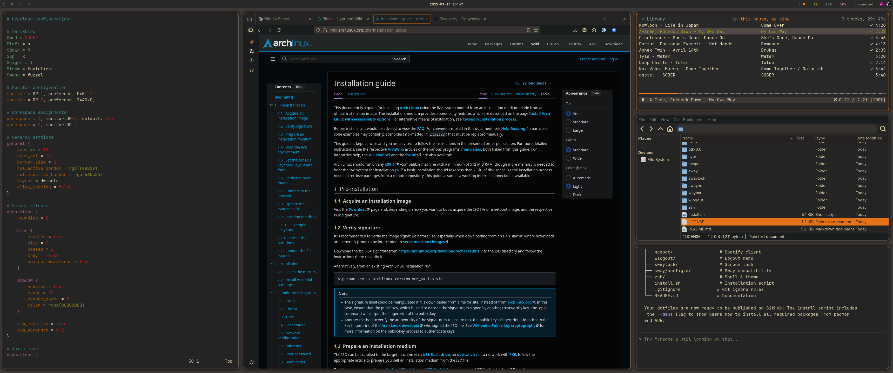

# Gruvbox Dotfiles

A total system theme based on Gruvbox for Hyprland and associated applications on Arch Linux.



## Overview

This dotfiles collection provides a cohesive Gruvbox Dark color scheme across:

- **Hyprland** - Wayland compositor with window management, animations, and visual effects
- **Waybar** - Status bar with system information and workspace indicators
- **SwayNC** - Notification center with Gruvbox styling
- **Foot** - Terminal emulator with Gruvbox colors
- **Fuzzel** - Application launcher with matching theme
- **GTK** - System-wide GTK theming
- **ncspot** - Terminal-based (ncurses) Spotify client with Gruvbox interface
- **swaylock** - Screen lock with Gruvbox colors
- **ZSH** - Shell configuration with Gruvbox prompt and FZF integration

## Installation

### Prerequisites

Install required packages:

```bash
# Official repositories
sudo pacman -S hyprland waybar swaync foot fuzzel swaylock \
               fzf zsh ttf-jetbrains-mono-nerd \
               brightnessctl playerctl grim slurp wl-clipboard \
               swaybg pactl

# AUR packages (optional)
yay -S ncspot hypridle hyprlock
```

Install Oh My Zsh and plugins:

```bash
# Oh My Zsh
sh -c "$(curl -fsSL https://raw.githubusercontent.com/ohmyzsh/ohmyzsh/master/tools/install.sh)"

# ZSH plugins
git clone https://github.com/zsh-users/zsh-autosuggestions \
  ${ZSH_CUSTOM:-~/.oh-my-zsh/custom}/plugins/zsh-autosuggestions

git clone https://github.com/zsh-users/zsh-syntax-highlighting \
  ${ZSH_CUSTOM:-~/.oh-my-zsh/custom}/plugins/zsh-syntax-highlighting
```

### Quick Install

```bash
git clone <repository-url> ~/dotfiles
cd ~/dotfiles
./install.sh
```

### Manual Installation

The install script will automatically:
1. Backup existing configuration files
2. Create symbolic links from `~/.config` to the dotfiles
3. Set up ZSH theme and configuration

To see dependency installation commands:
```bash
./install.sh --deps
```

## Configuration Structure

```
dotfiles/
├── hypr/                    # Hyprland window manager
│   ├── hyprland.conf       # Main configuration
│   ├── hyprlock.conf       # Lock screen
│   └── hypridle.conf       # Idle management
├── waybar/                  # Status bar
│   ├── config              # Waybar configuration
│   └── style.css           # Gruvbox styling
├── swaync/                  # Notification center
│   ├── config.json         # SwayNC settings
│   └── style.css           # Gruvbox notifications
├── foot/                    # Terminal emulator
│   └── foot.ini            # Gruvbox terminal colors
├── fuzzel/                  # Application launcher
│   └── fuzzel.ini          # Gruvbox launcher theme
├── gtk-3.0/                 # GTK theming
│   └── gtk.css             # System-wide GTK styling
├── ncspot/                  # Spotify client
│   └── config.toml         # Gruvbox ncspot theme
├── swaylock/                # Screen lock
│   └── config              # Gruvbox lock screen
├── sway/                    # Sway compatibility
│   └── config.d/
│       └── gruvbox.conf    # Sway color definitions
├── zsh/                     # Shell configuration
│   ├── zshrc               # ZSH config with FZF Gruvbox
│   └── themes/
│       └── gruvbox.zsh-theme # Custom ZSH prompt
├── install.sh               # Installation script
└── README.md               # This file
```

## Features

### Hyprland
- Gruvbox window borders and decorations
- Smooth animations and rounded corners
- Multi-monitor support with custom layouts
- Comprehensive keybindings for window management

### Waybar
- System monitoring (CPU, memory, network)
- Workspace indicators
- Notification center integration
- Gruvbox-themed modules

### Terminal & Shell
- Foot terminal with full Gruvbox color palette
- ZSH with custom Gruvbox prompt
- FZF integration with Gruvbox colors
- Syntax highlighting and autosuggestions

### Applications
- Fuzzel launcher with Gruvbox styling
- SwayNC notifications matching the theme
- GTK applications themed consistently
- Screen lock with Gruvbox colors

## Color Palette

The configuration uses the standard Gruvbox Dark palette:

- **Background**: `#282828`
- **Foreground**: `#ebdbb2`
- **Accent**: `#fe8019` (orange)
- **Secondary**: `#3c3836`
- **Success**: `#b8bb26` (green)
- **Warning**: `#fabd2f` (yellow)
- **Error**: `#fb4934` (red)
- **Info**: `#83a598` (blue)

## Keybindings

Key Hyprland shortcuts:
- `Super + .` - Open terminal
- `Super + Space` - Application launcher
- `Super + Shift + Q` - Close window
- `Super + F` - Fullscreen
- `Super + Shift + S` - Toggle group
- `Super + S` - Cycle group windows
- `Super + Ctrl + S` - Remove window from group
- `Super + W` - Window mode (vim-like navigation)
- `Super + R` - Resize mode

## Post-Installation

After installation:

1. Restart your terminal or run `source ~/.zshrc`
2. Restart Waybar: `killall waybar && waybar &`
3. Reload Hyprland: `hyprctl reload`
